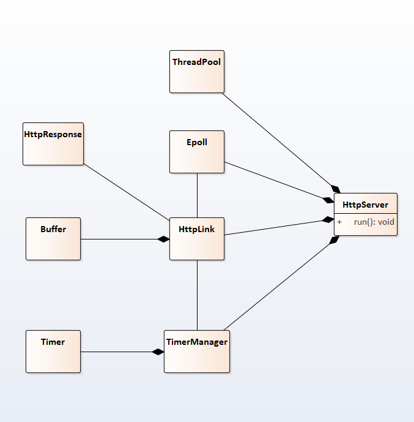

# cpp11_webserver
## 简介
此项目为c++11编写的的http静态服务器，解析了GET请求，可处理静态资源，支持HTTP长连接
## 开发环境
- 操作系统：ubuntu18.04
- 开发工具:win10+vs2019+ssh(vs连接linux系统下的远程开发，如何配置？<https://blog.csdn.net/xxxx00999/article/details/112021469?spm=1001.2014.3001.5501>)
## 技术要点
- 并发模型为Reactor
- 使用epoll水平触发+EPOLLONESHOT，非阻塞IO
- 使用多线程充分利用多核CPU，并使用线程池避免线程频繁创建销毁的开销
- 实现基于小根堆（std::priority_queue）的定时器，用于断开超时连接
- 实现可以自动增长的缓冲区(std::vector\<char>\)，作为HTTP连接的输入和输出缓冲区
## 简要类图
  

## 测试与改进

### 测试

- 系统：ubuntu18.04

- cup核心数：4

- 内存大小：4G

- 工具：webbench1.5，1000连接，时间60秒

  

### 改进

- 实现异步日志
- 支持优雅关闭连接